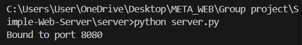
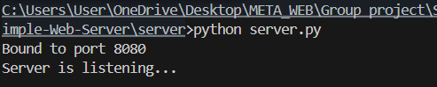
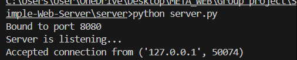
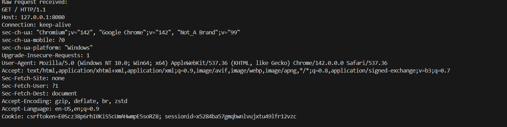

# Simple web server (python sockets)

This project is a group assignment to build a simple web server from scratch using python sockets.
The goal is to understand how HTTP works under the hood.

## Project structure
 - 'server/' -> python server code
 - 'static/' -> HTML/CSS/images served by the server
 - 'tests/' -> Unit tests
 - 'docs/' -> Design & documentation
 - 'examples/' -> Demo scripts and sample requests

 ## How to Run 
  1. Basic TCP Socket Server 
    The server performs the fundamental steps of handling HTTP requests:
    '''
        import socket

    HOST = "127.0.0.1"
    PORT = 8080

    server_socket = socket.socket(socket.AF_INET, socket.SOCK_STREAM)
    '''

   (a.) Bind to a Port
The server attaches itself to a specific IP + port (e.g., 127.0.0.1:8080) so browsers can find it.
    '''
        #Bind to port
    server_socket.bind((HOST, PORT))
    print("Bound to port", PORT)
    '''

 
    

    (b.) Listen for Connections 
After binding, the server enters a listening state, waiting for incoming client requests.
    '''
        #Listen
    server_socket.listen(1) 
    print("Server is listening...")
    '''

    (c.) Accept Client Connections
 When a browser attempts to connect, the server accepts the connection and establishes communication.
    '''
    client_socket, client_address = server_socket.accept() 
    print("Step 3 done: Accepted connection from", client_address)
    '''

    (d.) Receive and Print Raw HTTP Requests 
The server receives the full HTTP request message sent by the browser and prints it out to the terminal.
    '''
        #Print  raw request
    raw_request = client_socket.recv(1024) 
    print("Raw request received:") 
    print(raw_request.decode())
    '''

